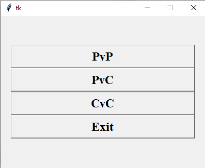
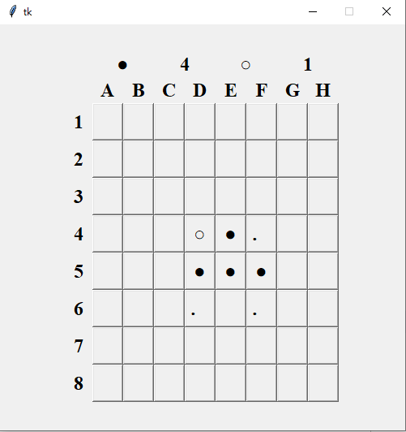

# python3-Othello
>This is just a project to practice Python and RL.





## Usage

```sh
py -3 Othello.py
```

## To do
1. Add the GUI for selecting agent algorithms.	(which will display the selection based on config)
2. Add the new algorithms.
